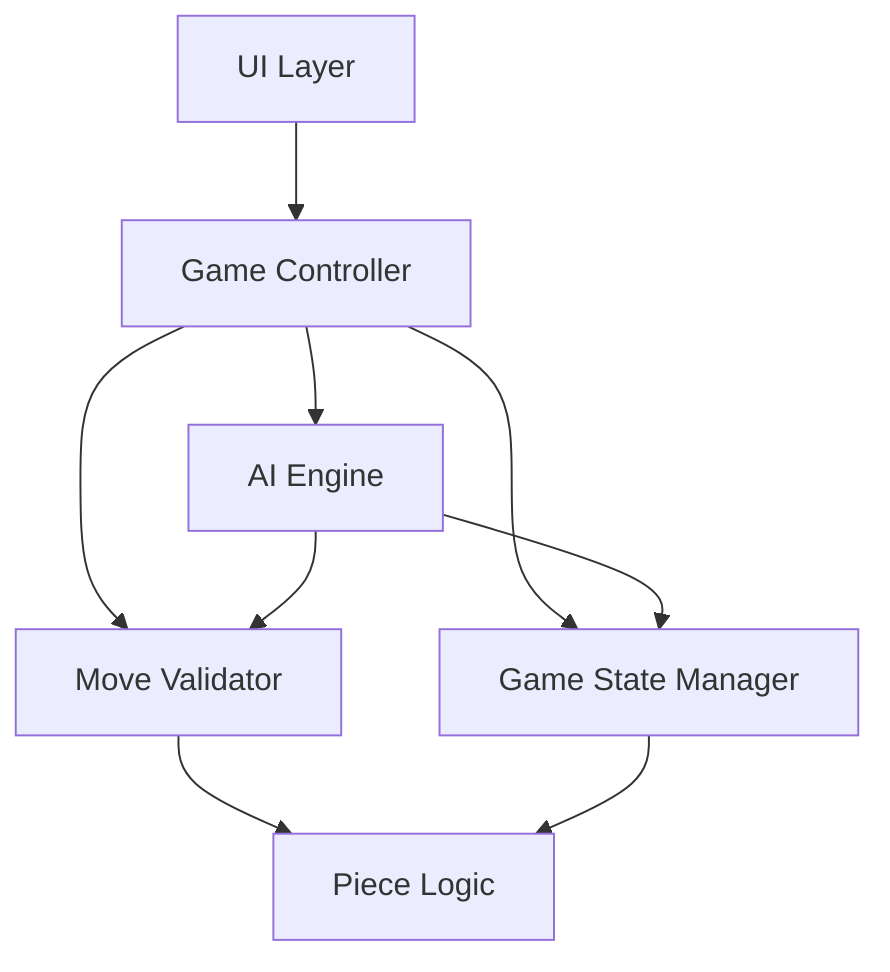
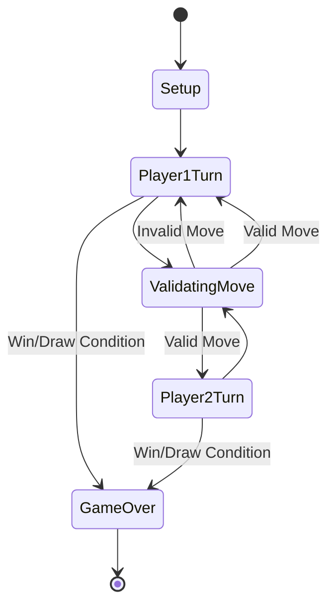
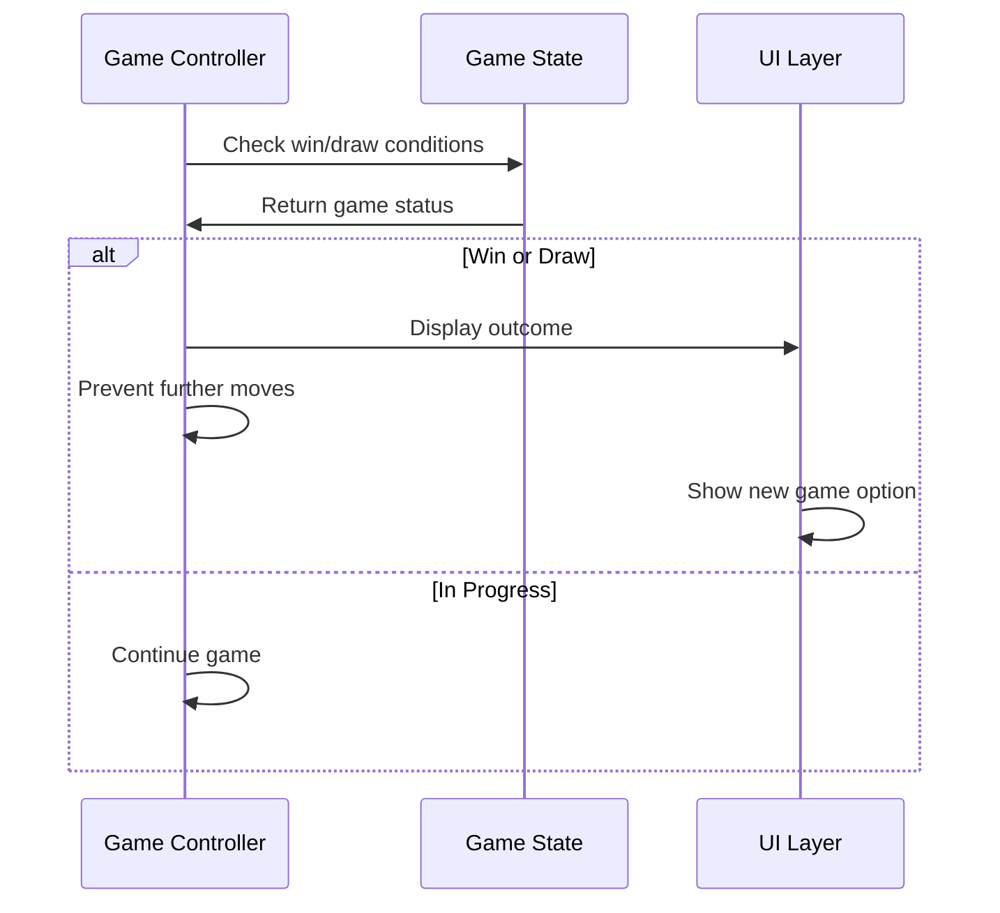
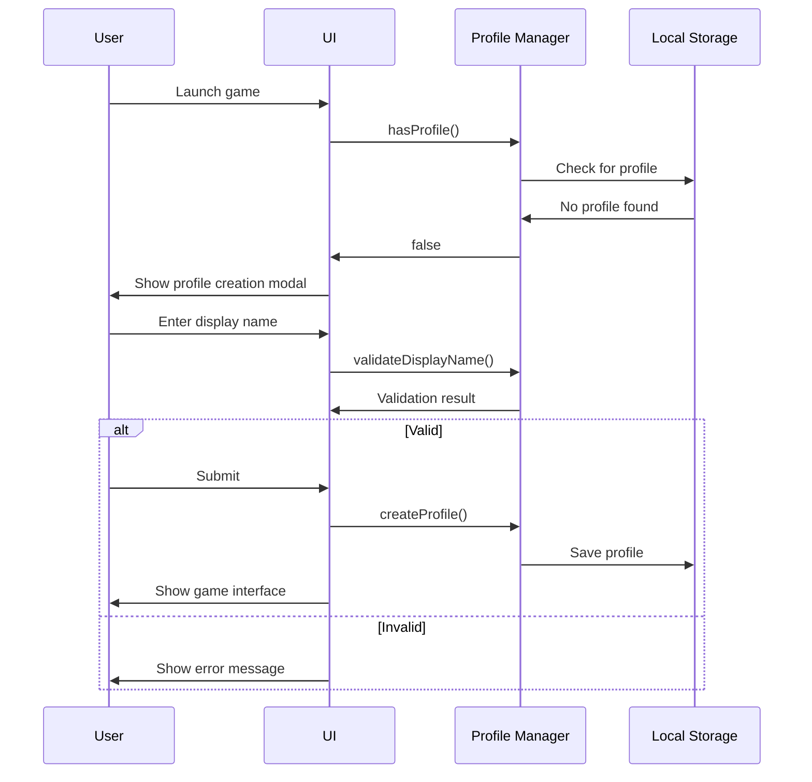
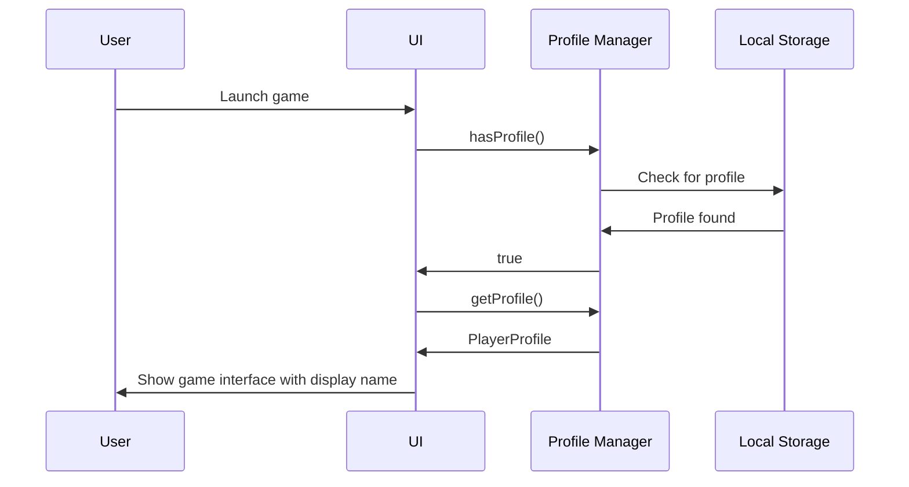

# Design Document

## Overview

This document outlines the design for a turn-based strategic board game featuring an 8x8 grid with unique piece mechanics, resource management, and AI opponent capabilities. The game supports both local player-vs-player (PvP) and player-vs-AI modes with configurable difficulty levels.

The system is designed as a web-based application using a component-based architecture that separates game logic from presentation. This separation enables testability, maintainability, and potential future extensions (e.g., online multiplayer, additional piece types).

**Key Design Decisions:**
- **Web-based implementation**: Provides cross-platform compatibility and responsive design without platform-specific builds
- **Separation of concerns**: Game logic is independent of UI, allowing for comprehensive unit testing and potential UI framework changes
- **Immutable game state**: State transitions create new state objects rather than mutating existing ones, simplifying undo functionality and state management
- **Minimax with alpha-beta pruning**: Industry-standard algorithm for turn-based games, providing strong AI performance with configurable difficulty

## Architecture

### High-Level Architecture



### Layer Responsibilities

**UI Layer**
- Renders the 8x8 board with current piece positions
- Handles user interactions (drag-and-drop, touch gestures)
- Displays game state (current player, resource points, move history)
- Shows feedback messages for invalid moves
- Provides controls for game mode, difficulty, new game, and restart

**Game Controller**
- Orchestrates game flow and turn management
- Processes player move requests through the Move Validator
- Triggers AI moves when appropriate
- Manages game mode switching (PvP vs AI)
- Handles undo requests
- Detects win/draw conditions

**Game State Manager**
- Maintains current board state (piece positions, types, ownership)
- Tracks resource points for both players
- Records move history
- Manages turn state
- Provides state snapshots for undo functionality

**Move Validator**
- Validates moves against piece-specific rules
- Checks path obstructions
- Verifies destination square validity
- Handles capture logic
- Returns validation results with error messages

**AI Engine**
- Implements minimax algorithm with alpha-beta pruning
- Evaluates board positions using heuristic scoring
- Generates and evaluates possible moves
- Respects difficulty-based search depth limits
- Returns optimal move within time constraints

**Piece Logic**
- Defines movement rules for each piece type (Pawn, Knight, Bishop, Queen)
- Calculates valid destination squares
- Handles piece-specific constraints (e.g., Pawn first move, Knight jumping)

## Components and Interfaces

### Core Data Structures

```typescript
enum PieceType {
  PAWN = 'PAWN',
  KNIGHT = 'KNIGHT',
  BISHOP = 'BISHOP',
  QUEEN = 'QUEEN'
}

enum Player {
  PLAYER_1 = 1,
  PLAYER_2 = 2
}

interface Position {
  row: number;  // 1-8
  col: number;  // 1-8
}

interface Piece {
  type: PieceType;
  owner: Player;
  position: Position;
  hasMoved: boolean;  // Tracks if piece has moved (relevant for Pawns)
  id: string;  // Unique identifier for tracking
}

interface BoardState {
  pieces: Piece[];
  currentPlayer: Player;
  resourcePoints: { [Player.PLAYER_1]: number; [Player.PLAYER_2]: number };
  moveCount: number;
  capturesSinceLastMove: number;  // For 50-move draw rule
}

interface Move {
  piece: Piece;
  from: Position;
  to: Position;
  capturedPiece?: Piece;
  isUpgrade?: boolean;
  timestamp: number;
}

interface MoveResult {
  valid: boolean;
  error?: string;
  newState?: BoardState;
  move?: Move;
}

interface GameConfig {
  mode: 'PVP' | 'AI';
  difficulty?: 'EASY' | 'HARD';
}

enum GameStatus {
  IN_PROGRESS = 'IN_PROGRESS',
  PLAYER_1_WIN = 'PLAYER_1_WIN',
  PLAYER_2_WIN = 'PLAYER_2_WIN',
  DRAW = 'DRAW'
}
```

### Component Interfaces

**GameController Interface**
```typescript
interface IGameController {
  initializeGame(config: GameConfig): void;
  attemptMove(from: Position, to: Position): MoveResult;
  attemptUpgrade(pieceId: string): MoveResult;
  undoMove(count: number): boolean;
  getGameState(): BoardState;
  getGameStatus(): GameStatus;
  getMoveHistory(): Move[];
  restartGame(): void;
  newGame(config: GameConfig): void;
}
```

**MoveValidator Interface**
```typescript
interface IMoveValidator {
  validateMove(piece: Piece, to: Position, board: BoardState): MoveResult;
  getValidMoves(piece: Piece, board: BoardState): Position[];
  isPathClear(from: Position, to: Position, board: BoardState): boolean;
}
```

**AIEngine Interface**
```typescript
interface IAIEngine {
  calculateBestMove(board: BoardState, depth: number): Move;
  evaluatePosition(board: BoardState, player: Player): number;
}
```

**PieceLogic Interface**
```typescript
interface IPieceLogic {
  getValidDestinations(piece: Piece, board: BoardState): Position[];
  canCapture(piece: Piece, target: Position, board: BoardState): boolean;
}
```

### Initial Board Setup

**Design Decision**: Pieces are arranged symmetrically with specific positioning to balance gameplay:
- Row 1 (Player 1): 4 Pawns, 4 Knights
- Row 2 (Player 1): 4 Bishops
- Row 7 (Player 2): 4 Bishops  
- Row 8 (Player 2): 4 Pawns, 4 Knights

This arrangement ensures both players have identical starting positions and strategic options.

## Data Models

### Piece Movement Rules

**Pawn**
- Direction: Forward only (toward row 8 for Player 1, toward row 1 for Player 2)
- Distance: 1-2 squares on first move, 1 square thereafter
- Capture: Cannot capture (simplified from chess)
- Special: Auto-promotes to Queen upon reaching row 8
- Obstruction: Cannot move through or onto occupied squares

**Knight**
- Pattern: L-shape (2 squares in one direction, 1 square perpendicular)
- Jump: Can jump over any pieces
- Capture: Captures by landing on opponent piece
- Valid destinations: 8 possible positions (if within board boundaries)

**Bishop**
- Direction: Diagonal only
- Distance: Any number of squares
- Capture: Captures by landing on opponent piece
- Obstruction: Cannot move through pieces; stops at first piece encountered

**Queen** (Promoted Pawn)
- Combines Bishop diagonal movement with extended forward movement
- Can move diagonally any distance or forward any distance
- Capture: Captures by landing on opponent piece
- Obstruction: Cannot move through pieces

### Resource System

**Design Decision**: Resource points create strategic depth by forcing players to choose between aggressive play (capturing for resources) and defensive positioning.

- **Earning**: 1 resource point per captured piece
- **Spending**: 2 resource points to upgrade a Pawn to Queen
- **Constraints**: Cannot upgrade Pawns on row 1 or row 8 (row 8 Pawns auto-promote)
- **Display**: Both players' resource counts visible at all times

### Game State Transitions



### Move History and Undo

**Design Decision**: Limiting undo to 3 moves prevents excessive backtracking while allowing tactical corrections.

- Move history stores complete move information including captures
- Undo reconstructs previous board state from history
- Maximum 3 moves can be undone
- Undo is available in both PvP and AI modes
- Move history displayed in sidebar with replay capability

## AI Implementation

### Minimax Algorithm with Alpha-Beta Pruning

**Design Decision**: Minimax provides optimal play for turn-based games, while alpha-beta pruning makes deeper search depths computationally feasible.

**Algorithm Overview:**
1. Generate all possible moves for current player
2. For each move, recursively evaluate opponent's best response
3. Select move that maximizes player's advantage while minimizing opponent's best counter
4. Alpha-beta pruning eliminates branches that cannot affect final decision

**Depth Configuration:**
- Easy: Depth 4 (looks ahead 4 half-moves)
- Hard: Depth 6 (looks ahead 6 half-moves)

**Time Constraint**: AI must complete move calculation within 5 seconds

### Position Evaluation Heuristic

The AI evaluates board positions using a weighted scoring system:

```typescript
function evaluatePosition(board: BoardState, player: Player): number {
  let score = 0;
  
  // Material value
  for (const piece of board.pieces) {
    const value = getPieceValue(piece.type);
    score += piece.owner === player ? value : -value;
  }
  
  // Resource points
  score += board.resourcePoints[player] * 10;
  score -= board.resourcePoints[opponent] * 10;
  
  // Positional bonuses
  score += evaluatePositioning(board, player);
  
  // Mobility (number of valid moves)
  score += countValidMoves(board, player) * 2;
  
  return score;
}

function getPieceValue(type: PieceType): number {
  switch (type) {
    case PieceType.PAWN: return 10;
    case PieceType.KNIGHT: return 30;
    case PieceType.BISHOP: return 30;
    case PieceType.QUEEN: return 50;
  }
}
```

**Design Rationale:**
- Material value reflects piece strength
- Resource points weighted heavily to encourage captures
- Positional bonuses reward board control
- Mobility scoring encourages flexible positioning

### Move Ordering Optimization

**Design Decision**: Evaluating captures first improves alpha-beta pruning efficiency by finding good moves early.

Moves are ordered for evaluation:
1. Captures (highest value targets first)
2. Upgrades (if resources available)
3. Forward advancement
4. Other moves

## Error Handling

### Move Validation Errors

All invalid moves return descriptive error messages:

- `"Invalid: out of bounds"` - Destination outside 8x8 grid
- `"Invalid: obstructed"` - Path blocked by another piece
- `"Invalid: blocked"` - Destination occupied by friendly piece
- `"Invalid: illegal move for piece type"` - Move violates piece movement rules
- `"Invalid: not your turn"` - Player attempting move out of turn
- `"Invalid: game over"` - Move attempted after game conclusion

**Design Decision**: Specific error messages help players understand game rules without consulting documentation.

### AI Error Handling

- If AI exceeds 5-second time limit, return best move found so far
- If no valid moves available, trigger win condition for opponent
- If evaluation encounters invalid state, log error and use fallback heuristic

### State Consistency

- All state transitions validated before application
- Invalid state transitions rejected with error
- Undo operations validated against history availability
- Board state integrity checked after each move

## Win and Draw Conditions

### Win Conditions

1. **Piece Count**: Opponent has fewer than 3 pieces remaining
2. **No Valid Moves**: Opponent has no legal moves available (stalemate variant)

**Design Decision**: Using piece count threshold (< 3) provides clear victory condition while preventing prolonged endgames.

### Draw Condition

**50-Move Rule**: If 50 consecutive moves occur without any capture, game is declared a draw

**Design Decision**: Prevents infinite games while allowing sufficient time for strategic maneuvering.

### End Game Flow



## UI Design

### Responsive Layout

**Design Decision**: Mobile-first responsive design ensures playability on all devices without separate implementations.

**Desktop Layout (≥768px):**
```
+----------------------------------+
|  Header (Mode, Difficulty, New)  |
+----------------------------------+
|          |                       |
|  Move    |      8x8 Board        |
| History  |                       |
| Sidebar  |                       |
|          |                       |
+----------+-----------------------+
|  Resource Points | Current Turn  |
+----------------------------------+
```

**Mobile Layout (<768px):**
```
+----------------------------------+
|  Header (Mode, Difficulty, New)  |
+----------------------------------+
|                                  |
|         8x8 Board                |
|                                  |
+----------------------------------+
|  Resource Points | Current Turn  |
+----------------------------------+
|  Move History (Collapsible)      |
+----------------------------------+
```

### Interaction Design

**Drag and Drop:**
- Mouse: Click and drag piece to destination
- Touch: Touch and drag piece to destination
- Visual feedback: Piece follows cursor/finger
- Valid destinations highlighted during drag
- Invalid drop returns piece to origin with error tooltip

**Board Orientation:**
- Player 1 view: Row 1 at bottom, Row 8 at top
- Player 2 view (PvP mode): Board flips 180° on turn change
- AI mode: Board remains in Player 1 orientation

**Visual Feedback:**
- Current player indicator
- Selected piece highlight
- Valid move indicators
- Capture animations
- Promotion animations
- Error tooltips (2-second display)

### Move History Sidebar

**Features:**
- Chronological list of all moves
- Format: "P1: Pawn E2→E4" or "P2: Knight B8→C6 (capture)"
- Click any move to replay board state at that point
- Scroll to view full history
- Undo button (reverts last 1-3 moves)

## Testing Strategy

### Unit Tests

**Game Logic Tests:**
- Piece movement validation for all piece types
- Capture logic
- Pawn promotion (auto and manual upgrade)
- Resource point earning and spending
- Win/draw condition detection
- Move history and undo functionality
- Board state transitions

**AI Tests:**
- Minimax algorithm correctness
- Alpha-beta pruning optimization
- Position evaluation accuracy
- Move ordering
- Depth-limited search
- Time constraint compliance
- Difficulty level behavior

**Validation Tests:**
- Path obstruction detection
- Boundary checking
- Turn enforcement
- Invalid move rejection
- Error message accuracy

### Integration Tests

**Game Flow Tests:**
- Complete game from initialization to win/draw
- Mode switching (PvP ↔ AI)
- Difficulty changes
- New game and restart functionality
- Undo during active game

**UI Interaction Tests:**
- Drag and drop piece movement
- Touch gesture handling
- Board orientation flip
- Move history replay
- Control button functionality
- Responsive layout adaptation

### Test Coverage Goals

**Target**: 100% code coverage across all modules

**Coverage Areas:**
- All piece movement rules and edge cases
- All game state transitions
- All win/draw conditions
- All error conditions
- AI decision-making at both difficulty levels
- UI event handlers and rendering logic

**Testing Tools:**
- Unit testing framework (Jest/Vitest)
- Integration testing (Testing Library)
- Coverage reporting (Istanbul/c8)
- E2E testing for full game scenarios

### Test Data

**Standard Test Scenarios:**
- Opening moves
- Mid-game captures
- Pawn promotion sequences
- Resource management decisions
- Endgame with < 3 pieces
- 50-move draw approach
- AI vs AI games at both difficulties

## Performance Considerations

### AI Performance

- Alpha-beta pruning reduces search space by ~50-90%
- Move ordering improves pruning efficiency
- Depth 4 (Easy): ~1-2 seconds per move
- Depth 6 (Hard): ~3-5 seconds per move
- Iterative deepening for time management

### UI Performance

- Virtual DOM for efficient rendering
- Debounced drag events
- Lazy loading of move history
- Optimized board re-rendering (only changed squares)

### Memory Management

- Immutable state prevents memory leaks
- Move history capped at reasonable limit (e.g., 200 moves)
- AI search tree garbage collected after move selection

## Player Profile System

### Overview

The player profile system allows users to create personalized profiles with custom display names that persist across game sessions. This enhances the gaming experience by replacing generic "Player 1" and "Player 2" labels with user-chosen identities.

**Design Decision**: Using browser local storage provides simple persistence without requiring backend infrastructure, keeping the application fully client-side.

### Data Model

```typescript
interface PlayerProfile {
  id: string;  // UUID for unique identification
  displayName: string;  // User-chosen name (1-20 characters)
  createdAt: number;  // Timestamp
  gamesPlayed?: number;  // Optional: track statistics
  wins?: number;  // Optional: track statistics
}

interface ProfileValidationResult {
  valid: boolean;
  error?: string;
}
```

### Profile Manager Interface

```typescript
interface IProfileManager {
  createProfile(displayName: string): PlayerProfile;
  getProfile(): PlayerProfile | null;
  updateProfile(profile: PlayerProfile): void;
  updateDisplayName(newDisplayName: string): ProfileValidationResult;
  validateDisplayName(name: string): ProfileValidationResult;
  hasProfile(): boolean;
  clearProfile(): void;
}
```

### Validation Rules

**Display Name Requirements:**
- Length: 1-20 characters
- Allowed characters: Alphanumeric (a-z, A-Z, 0-9) and spaces
- No leading or trailing spaces
- No consecutive spaces

**Validation Implementation:**
```typescript
function validateDisplayName(name: string): ProfileValidationResult {
  const trimmed = name.trim();
  
  if (trimmed.length < 1) {
    return { valid: false, error: "Display name cannot be empty" };
  }
  
  if (trimmed.length > 20) {
    return { valid: false, error: "Display name must be 20 characters or less" };
  }
  
  const validPattern = /^[a-zA-Z0-9]+( [a-zA-Z0-9]+)*$/;
  if (!validPattern.test(trimmed)) {
    return { valid: false, error: "Display name can only contain letters, numbers, and single spaces" };
  }
  
  return { valid: true };
}
```

### Storage Strategy

**Local Storage Schema:**
```typescript
// Key: 'playerProfile'
// Value: JSON-serialized PlayerProfile object
{
  "id": "uuid-v4-string",
  "displayName": "PlayerName",
  "createdAt": 1234567890,
  "gamesPlayed": 0,
  "wins": 0
}
```

**Design Decision**: Single profile per browser simplifies implementation. Future enhancement could support multiple profiles with profile selection.

### UI Flow

**First-Time User Experience:**


**Returning User Experience:**


### Integration with Game System

**Display Name Usage:**
- Replace "Player 1" with user's display name
- In PvP mode: Prompt second player for display name (session-only or separate profile)
- In AI mode: User's display name vs "AI Opponent"
- Show display names in:
  - Current turn indicator
  - Move history ("John: Pawn E2→E4")
  - Win/draw announcements ("John wins!")
  - Resource point display

**Game State Integration:**
```typescript
interface BoardState {
  pieces: Piece[];
  currentPlayer: Player;
  playerNames: { [Player.PLAYER_1]: string; [Player.PLAYER_2]: string };
  resourcePoints: { [Player.PLAYER_1]: number; [Player.PLAYER_2]: number };
  moveCount: number;
  capturesSinceLastMove: number;
}
```

### Profile Management UI

**Profile Creation Modal:**
- Centered modal overlay
- Input field for display name
- Real-time validation feedback
- Character counter (X/20)
- Submit button (disabled until valid)
- Cannot be dismissed without creating profile

**Profile Settings Menu:**
- Access via settings icon/button in game header
- Opens modal overlay with profile options
- Shows current display name
- Provides "Edit Display Name" option
- Shows statistics (games played, wins) - optional
- Provides "Clear Profile" option with confirmation dialog

**Edit Display Name Flow:**
- Opens edit modal with current name pre-filled
- Input field with same validation as creation
- Real-time validation feedback
- Character counter (X/20)
- "Save" button (disabled until valid and changed)
- "Cancel" button to dismiss without changes
- On save, updates profile in local storage
- Shows success confirmation message
- Updates display name throughout UI immediately

### Error Handling

**Storage Errors:**
- If local storage is unavailable (privacy mode, quota exceeded):
  - Fall back to session-only profile (not persisted)
  - Show warning message to user
  - Profile lost on page refresh

**Validation Errors:**
- Display inline error messages below input field
- Prevent submission until valid
- Clear error on input change

**Profile Load Errors:**
- If stored profile is corrupted:
  - Clear corrupted data
  - Prompt user to create new profile
  - Log error for debugging

### Testing Considerations

**Unit Tests:**
- Display name validation (all edge cases)
- Profile creation and storage
- Profile retrieval
- Profile update
- Validation error messages

**Integration Tests:**
- First-time user flow
- Returning user flow
- Profile persistence across page reloads
- Display name shown in game UI
- Local storage fallback scenarios

## Cyberpunk Theme Design

### Overview

The cyberpunk theme transforms the game interface into a high-end gaming experience with dark aesthetics, neon glows, particle effects, and smooth animations. This enhancement maintains all existing functionality while elevating the visual presentation to create an immersive, futuristic atmosphere.

**Design Philosophy:**
- Dark backgrounds with high contrast neon accents
- Smooth, purposeful animations that enhance rather than distract
- Particle effects for key moments to create impact
- Consistent cyberpunk aesthetic across all UI elements
- Performance-optimized visual effects

### Color Palette

**Primary Colors:**
```css
--bg-primary: #0a0e27;        /* Deep space blue-black */
--bg-secondary: #1a1f3a;      /* Slightly lighter panel background */
--bg-tertiary: #252b4a;       /* Elevated element background */

--neon-cyan: #00f0ff;         /* Primary neon accent */
--neon-magenta: #ff00ff;      /* Secondary neon accent */
--neon-purple: #b000ff;       /* Tertiary neon accent */
--neon-blue: #0080ff;         /* Quaternary neon accent */

--text-primary: #e0e6ff;      /* High contrast text */
--text-secondary: #8892b0;    /* Muted text */
--text-dim: #4a5578;          /* Very muted text */

--player1-color: #00f0ff;     /* Cyan for Player 1 */
--player2-color: #ff00ff;     /* Magenta for Player 2 */

--success: #00ff88;           /* Success states */
--warning: #ffaa00;           /* Warning states */
--error: #ff0055;             /* Error states */
```

**Design Decision**: Cyan and magenta provide strong contrast for player differentiation while maintaining the cyberpunk aesthetic. Purple and blue serve as neutral accents.

### Neon Glow Effects

**CSS Implementation:**
```css
.neon-glow-cyan {
  box-shadow: 
    0 0 5px rgba(0, 240, 255, 0.5),
    0 0 10px rgba(0, 240, 255, 0.3),
    0 0 20px rgba(0, 240, 255, 0.2),
    inset 0 0 10px rgba(0, 240, 255, 0.1);
  border: 1px solid rgba(0, 240, 255, 0.6);
}

.neon-glow-magenta {
  box-shadow: 
    0 0 5px rgba(255, 0, 255, 0.5),
    0 0 10px rgba(255, 0, 255, 0.3),
    0 0 20px rgba(255, 0, 255, 0.2),
    inset 0 0 10px rgba(255, 0, 255, 0.1);
  border: 1px solid rgba(255, 0, 255, 0.6);
}

.neon-glow-hover {
  transition: all 0.3s ease;
}

.neon-glow-hover:hover {
  box-shadow: 
    0 0 8px rgba(0, 240, 255, 0.7),
    0 0 15px rgba(0, 240, 255, 0.5),
    0 0 30px rgba(0, 240, 255, 0.3),
    inset 0 0 15px rgba(0, 240, 255, 0.2);
  filter: brightness(1.2);
}
```

**Glow Intensity Levels:**
- **Subtle**: Background elements, inactive states (20% opacity)
- **Normal**: Active elements, pieces, borders (40-60% opacity)
- **Intense**: Hover states, selected elements (70-100% opacity)
- **Pulsing**: Animated glow for attention-grabbing elements

**Design Decision**: Multi-layered box shadows create depth and authentic neon tube appearance. Inset shadows add dimensionality.

### Animation System

**Animation Timing Functions:**
```css
--ease-smooth: cubic-bezier(0.4, 0.0, 0.2, 1);
--ease-bounce: cubic-bezier(0.68, -0.55, 0.265, 1.55);
--ease-snap: cubic-bezier(0.25, 0.46, 0.45, 0.94);
```

**Core Animations:**

**1. Piece Movement (300ms)**
```css
@keyframes piece-move {
  0% {
    transform: translate(var(--from-x), var(--from-y)) scale(1);
  }
  50% {
    transform: translate(
      calc((var(--from-x) + var(--to-x)) / 2),
      calc((var(--from-y) + var(--to-y)) / 2)
    ) scale(1.1);
  }
  100% {
    transform: translate(var(--to-x), var(--to-y)) scale(1);
  }
}
```

**2. Piece Capture (400ms)**
```css
@keyframes piece-capture {
  0% {
    opacity: 1;
    transform: scale(1) rotate(0deg);
    filter: brightness(1);
  }
  50% {
    opacity: 0.5;
    transform: scale(1.2) rotate(180deg);
    filter: brightness(2);
  }
  100% {
    opacity: 0;
    transform: scale(0) rotate(360deg);
    filter: brightness(0);
  }
}
```

**3. Pawn Promotion (600ms)**
```css
@keyframes pawn-promotion {
  0% {
    transform: scale(1);
    filter: brightness(1) drop-shadow(0 0 0 transparent);
  }
  25% {
    transform: scale(1.3);
    filter: brightness(2) drop-shadow(0 0 20px var(--neon-cyan));
  }
  50% {
    transform: scale(0.8);
    filter: brightness(3) drop-shadow(0 0 30px var(--neon-cyan));
  }
  75% {
    transform: scale(1.2);
    filter: brightness(2) drop-shadow(0 0 20px var(--neon-cyan));
  }
  100% {
    transform: scale(1);
    filter: brightness(1.5) drop-shadow(0 0 10px var(--neon-cyan));
  }
}
```

**4. Board Flip (500ms)**
```css
@keyframes board-flip {
  0% {
    transform: perspective(1000px) rotateX(0deg);
  }
  50% {
    transform: perspective(1000px) rotateX(90deg);
  }
  100% {
    transform: perspective(1000px) rotateX(180deg);
  }
}
```

**5. Modal Slide-In (250ms)**
```css
@keyframes modal-slide-in {
  0% {
    transform: translateY(-100%);
    opacity: 0;
  }
  100% {
    transform: translateY(0);
    opacity: 1;
  }
}
```

**6. Glow Pulse (2s, infinite)**
```css
@keyframes glow-pulse {
  0%, 100% {
    box-shadow: 0 0 5px var(--neon-color);
  }
  50% {
    box-shadow: 0 0 20px var(--neon-color), 0 0 30px var(--neon-color);
  }
}
```

**Design Decision**: Animation durations are calibrated to feel responsive without being jarring. Easing functions create natural, physics-inspired motion.

### Particle System

**Particle Engine Architecture:**
```typescript
interface Particle {
  id: string;
  x: number;
  y: number;
  vx: number;  // Velocity X
  vy: number;  // Velocity Y
  life: number;  // 0-1, decreases over time
  maxLife: number;  // Duration in ms
  size: number;
  color: string;
  glow: boolean;
}

interface ParticleEmitter {
  position: { x: number; y: number };
  particleCount: number;
  particleConfig: Partial<Particle>;
  emissionPattern: 'burst' | 'continuous' | 'directional';
  duration: number;
}

class ParticleSystem {
  private particles: Particle[] = [];
  private emitters: ParticleEmitter[] = [];
  
  emit(emitter: ParticleEmitter): void;
  update(deltaTime: number): void;
  render(ctx: CanvasRenderingContext2D): void;
  clear(): void;
}
```

**Particle Effects:**

**1. Capture Effect**
- **Trigger**: When piece is captured
- **Pattern**: Burst from capture location
- **Particles**: 20-30 particles
- **Colors**: Capturing player's color (cyan or magenta)
- **Velocity**: Radial outward, 100-200px/s
- **Life**: 500-800ms
- **Size**: 2-4px with glow
- **Behavior**: Fade out and slow down over lifetime

**2. Promotion Effect**
- **Trigger**: When Pawn promotes to Queen
- **Pattern**: Burst + upward stream
- **Particles**: 40-60 particles
- **Colors**: Player's color with white sparkles
- **Velocity**: Upward bias, 150-250px/s
- **Life**: 800-1200ms
- **Size**: 3-6px with intense glow
- **Behavior**: Rise and fade, some particles linger

**3. Victory Effect**
- **Trigger**: When player wins
- **Pattern**: Continuous emission across board
- **Particles**: 100+ particles over 3 seconds
- **Colors**: Winner's color with rainbow accents
- **Velocity**: Varied, some rising, some falling
- **Life**: 1000-2000ms
- **Size**: 4-8px with glow
- **Behavior**: Celebratory cascade effect

**4. Valid Move Indicators**
- **Trigger**: When piece is selected
- **Pattern**: Subtle pulse at valid destinations
- **Particles**: 5-10 particles per destination
- **Colors**: Dim cyan/magenta
- **Velocity**: Minimal, slight float
- **Life**: Continuous while piece selected
- **Size**: 1-2px
- **Behavior**: Gentle pulse and float

**Canvas Rendering:**
```typescript
function renderParticle(ctx: CanvasRenderingContext2D, particle: Particle): void {
  ctx.save();
  
  // Apply glow effect
  if (particle.glow) {
    ctx.shadowBlur = 10;
    ctx.shadowColor = particle.color;
  }
  
  // Set opacity based on life
  ctx.globalAlpha = particle.life;
  
  // Draw particle
  ctx.fillStyle = particle.color;
  ctx.beginPath();
  ctx.arc(particle.x, particle.y, particle.size, 0, Math.PI * 2);
  ctx.fill();
  
  ctx.restore();
}
```

**Design Decision**: Canvas-based particle system provides smooth 60fps rendering without DOM overhead. Particle count is limited to maintain performance on mobile devices.

### Board Styling

**Square Design:**
```css
.board-square {
  background: linear-gradient(135deg, #1a1f3a 0%, #252b4a 100%);
  border: 1px solid rgba(0, 240, 255, 0.2);
  position: relative;
  transition: all 0.2s ease;
}

.board-square::before {
  content: '';
  position: absolute;
  inset: 0;
  background: radial-gradient(circle at center, transparent 60%, rgba(0, 240, 255, 0.05) 100%);
  opacity: 0;
  transition: opacity 0.3s ease;
}

.board-square:hover::before {
  opacity: 1;
}

.board-square.valid-destination {
  border-color: rgba(0, 240, 255, 0.6);
  background: linear-gradient(135deg, #1a1f3a 0%, rgba(0, 240, 255, 0.1) 100%);
}

.board-square.selected {
  border-color: rgba(0, 240, 255, 1);
  box-shadow: 
    inset 0 0 20px rgba(0, 240, 255, 0.3),
    0 0 10px rgba(0, 240, 255, 0.5);
}
```

**Piece Styling:**
```css
.piece {
  filter: drop-shadow(0 0 8px var(--player-color));
  transition: all 0.3s ease;
  cursor: grab;
}

.piece:hover {
  filter: drop-shadow(0 0 15px var(--player-color)) brightness(1.2);
  transform: scale(1.05);
}

.piece:active {
  cursor: grabbing;
  transform: scale(0.95);
}

.piece.player1 {
  --player-color: var(--neon-cyan);
}

.piece.player2 {
  --player-color: var(--neon-magenta);
}
```

**Grid Lines:**
```css
.board-container {
  background: 
    linear-gradient(90deg, rgba(0, 240, 255, 0.1) 1px, transparent 1px),
    linear-gradient(rgba(0, 240, 255, 0.1) 1px, transparent 1px);
  background-size: calc(100% / 8) calc(100% / 8);
}
```

**Design Decision**: Gradient backgrounds and subtle grid lines create depth. Glow effects on hover provide clear interaction feedback.

### Profile Settings Modal

**Modal Structure:**
```typescript
interface ProfileModalProps {
  isOpen: boolean;
  onClose: () => void;
  profile: PlayerProfile;
  onSave: (profile: PlayerProfile) => void;
}
```

**Modal Styling:**
```css
.profile-modal-backdrop {
  position: fixed;
  inset: 0;
  background: rgba(10, 14, 39, 0.9);
  backdrop-filter: blur(10px);
  display: flex;
  align-items: center;
  justify-content: center;
  z-index: 1000;
  animation: fade-in 0.25s ease;
}

.profile-modal {
  background: linear-gradient(135deg, #1a1f3a 0%, #252b4a 100%);
  border: 2px solid rgba(0, 240, 255, 0.5);
  border-radius: 12px;
  padding: 32px;
  max-width: 500px;
  width: 90%;
  box-shadow: 
    0 0 20px rgba(0, 240, 255, 0.3),
    0 0 40px rgba(0, 240, 255, 0.1),
    inset 0 0 20px rgba(0, 240, 255, 0.05);
  animation: modal-slide-in 0.25s ease;
}

.profile-modal-header {
  color: var(--neon-cyan);
  font-size: 24px;
  font-weight: 700;
  text-shadow: 0 0 10px rgba(0, 240, 255, 0.5);
  margin-bottom: 24px;
}

.profile-input {
  background: rgba(10, 14, 39, 0.6);
  border: 1px solid rgba(0, 240, 255, 0.3);
  border-radius: 6px;
  padding: 12px 16px;
  color: var(--text-primary);
  font-size: 16px;
  width: 100%;
  transition: all 0.3s ease;
}

.profile-input:focus {
  outline: none;
  border-color: var(--neon-cyan);
  box-shadow: 0 0 10px rgba(0, 240, 255, 0.3);
}

.profile-button {
  background: linear-gradient(135deg, rgba(0, 240, 255, 0.2) 0%, rgba(0, 240, 255, 0.1) 100%);
  border: 1px solid var(--neon-cyan);
  border-radius: 6px;
  padding: 12px 24px;
  color: var(--neon-cyan);
  font-weight: 600;
  cursor: pointer;
  transition: all 0.3s ease;
}

.profile-button:hover {
  background: linear-gradient(135deg, rgba(0, 240, 255, 0.3) 0%, rgba(0, 240, 255, 0.2) 100%);
  box-shadow: 0 0 15px rgba(0, 240, 255, 0.4);
  transform: translateY(-2px);
}
```

**Profile Settings Icon:**
```css
.profile-icon {
  position: fixed;
  top: 20px;
  right: 20px;
  width: 48px;
  height: 48px;
  border-radius: 50%;
  background: linear-gradient(135deg, rgba(0, 240, 255, 0.2) 0%, rgba(176, 0, 255, 0.2) 100%);
  border: 2px solid var(--neon-cyan);
  display: flex;
  align-items: center;
  justify-content: center;
  cursor: pointer;
  transition: all 0.3s ease;
  z-index: 100;
}

.profile-icon:hover {
  box-shadow: 0 0 20px rgba(0, 240, 255, 0.6);
  transform: scale(1.1) rotate(90deg);
}
```

**Design Decision**: Modal uses backdrop blur for depth separation. Slide-in animation creates smooth entrance. Icon placement in top-right follows common UI patterns.

### Move History Sidebar

**Sidebar Styling:**
```css
.move-history-sidebar {
  background: linear-gradient(180deg, #1a1f3a 0%, #0a0e27 100%);
  border-right: 2px solid rgba(0, 240, 255, 0.3);
  padding: 20px;
  overflow-y: auto;
  height: 100%;
}

.move-history-item {
  background: rgba(37, 43, 74, 0.5);
  border-left: 3px solid transparent;
  padding: 12px;
  margin-bottom: 8px;
  border-radius: 4px;
  cursor: pointer;
  transition: all 0.2s ease;
}

.move-history-item.player1 {
  border-left-color: var(--neon-cyan);
}

.move-history-item.player2 {
  border-left-color: var(--neon-magenta);
}

.move-history-item:hover {
  background: rgba(37, 43, 74, 0.8);
  box-shadow: 0 0 10px rgba(0, 240, 255, 0.2);
  transform: translateX(4px);
}

.move-history-item.active {
  background: rgba(0, 240, 255, 0.1);
  border-left-width: 5px;
  box-shadow: 0 0 15px rgba(0, 240, 255, 0.3);
}
```

**Mobile Collapsible:**
```css
@media (max-width: 768px) {
  .move-history-sidebar {
    position: fixed;
    bottom: 0;
    left: 0;
    right: 0;
    height: auto;
    max-height: 40vh;
    border-right: none;
    border-top: 2px solid rgba(0, 240, 255, 0.3);
    transform: translateY(calc(100% - 60px));
    transition: transform 0.3s ease;
  }
  
  .move-history-sidebar.expanded {
    transform: translateY(0);
  }
  
  .move-history-toggle {
    position: absolute;
    top: 0;
    left: 50%;
    transform: translateX(-50%);
    width: 60px;
    height: 6px;
    background: var(--neon-cyan);
    border-radius: 3px;
    margin-top: 8px;
  }
}
```

**Design Decision**: Color-coded borders distinguish players. Hover effects provide clear interaction feedback. Mobile version collapses to save screen space.

### Game Controls

**Control Panel Styling:**
```css
.game-controls {
  background: linear-gradient(90deg, #1a1f3a 0%, #252b4a 50%, #1a1f3a 100%);
  border: 1px solid rgba(0, 240, 255, 0.3);
  border-radius: 8px;
  padding: 16px;
  display: flex;
  gap: 12px;
  align-items: center;
  justify-content: space-between;
}

.control-button {
  background: linear-gradient(135deg, rgba(0, 240, 255, 0.15) 0%, rgba(176, 0, 255, 0.15) 100%);
  border: 1px solid var(--neon-cyan);
  border-radius: 6px;
  padding: 10px 20px;
  color: var(--text-primary);
  font-weight: 600;
  cursor: pointer;
  transition: all 0.3s ease;
  position: relative;
  overflow: hidden;
}

.control-button::before {
  content: '';
  position: absolute;
  top: 50%;
  left: 50%;
  width: 0;
  height: 0;
  background: radial-gradient(circle, rgba(0, 240, 255, 0.3) 0%, transparent 70%);
  transform: translate(-50%, -50%);
  transition: width 0.6s ease, height 0.6s ease;
  border-radius: 50%;
}

.control-button:hover::before {
  width: 300px;
  height: 300px;
}

.control-button:hover {
  border-color: var(--neon-cyan);
  box-shadow: 0 0 15px rgba(0, 240, 255, 0.4);
  transform: translateY(-2px);
}

.control-button:active {
  transform: translateY(0);
}
```

**Difficulty Selector:**
```css
.difficulty-selector {
  display: flex;
  gap: 8px;
  background: rgba(10, 14, 39, 0.6);
  border-radius: 6px;
  padding: 4px;
}

.difficulty-option {
  padding: 8px 16px;
  border-radius: 4px;
  cursor: pointer;
  transition: all 0.3s ease;
  color: var(--text-secondary);
}

.difficulty-option.active {
  background: linear-gradient(135deg, var(--neon-cyan) 0%, var(--neon-purple) 100%);
  color: var(--bg-primary);
  font-weight: 700;
  box-shadow: 0 0 10px rgba(0, 240, 255, 0.5);
}

.difficulty-option:hover:not(.active) {
  background: rgba(0, 240, 255, 0.1);
  color: var(--text-primary);
}
```

**Design Decision**: Ripple effect on button click creates tactile feedback. Gradient backgrounds and glows maintain cyberpunk aesthetic.

### Typography

**Font Stack:**
```css
:root {
  --font-primary: 'Rajdhani', 'Orbitron', 'Exo 2', sans-serif;
  --font-mono: 'Share Tech Mono', 'Courier New', monospace;
}

body {
  font-family: var(--font-primary);
  font-weight: 400;
  line-height: 1.6;
  color: var(--text-primary);
}

h1, h2, h3 {
  font-weight: 700;
  text-transform: uppercase;
  letter-spacing: 0.1em;
  text-shadow: 0 0 10px rgba(0, 240, 255, 0.3);
}

.mono {
  font-family: var(--font-mono);
}
```

**Design Decision**: Geometric sans-serif fonts (Rajdhani, Orbitron) evoke futuristic aesthetic. Monospace for technical elements like move notation.

### Performance Optimization

**Animation Performance:**
- Use `transform` and `opacity` for animations (GPU-accelerated)
- Avoid animating `width`, `height`, `top`, `left` (triggers layout)
- Use `will-change` sparingly for critical animations
- Debounce particle emission to maintain 60fps

**Particle System Optimization:**
- Limit active particles to 200 maximum
- Use object pooling to avoid garbage collection
- Cull particles outside viewport
- Reduce particle count on mobile devices (50% reduction)

**CSS Optimization:**
```css
.animated-element {
  will-change: transform, opacity;
  transform: translateZ(0); /* Force GPU layer */
}
```

**Design Decision**: Hardware acceleration ensures smooth 60fps animations even on mid-range devices. Particle limits prevent performance degradation.

### Responsive Behavior

**Breakpoints:**
```css
/* Mobile: < 768px */
/* Tablet: 768px - 1024px */
/* Desktop: > 1024px */
```

**Mobile Adaptations:**
- Reduce glow intensity (50% of desktop)
- Simplify particle effects (fewer particles, shorter life)
- Collapse move history to bottom drawer
- Larger touch targets (minimum 44x44px)
- Simplified animations (shorter durations)

**Touch Interactions:**
```typescript
// Prevent default touch behaviors
element.addEventListener('touchstart', (e) => {
  e.preventDefault();
  // Handle touch
}, { passive: false });

// Add touch feedback
element.addEventListener('touchstart', () => {
  element.classList.add('touch-active');
});

element.addEventListener('touchend', () => {
  element.classList.remove('touch-active');
});
```

**Design Decision**: Mobile-first approach ensures core experience works on all devices. Progressive enhancement adds richer effects on capable hardware.

### Accessibility Considerations

**Color Contrast:**
- All text meets WCAG AA standards (4.5:1 minimum)
- Neon colors used for accents, not primary text
- High contrast mode available via CSS media query

**Reduced Motion:**
```css
@media (prefers-reduced-motion: reduce) {
  * {
    animation-duration: 0.01ms !important;
    animation-iteration-count: 1 !important;
    transition-duration: 0.01ms !important;
  }
  
  .particle-system {
    display: none;
  }
}
```

**Keyboard Navigation:**
- All interactive elements focusable
- Focus indicators with neon glow
- Keyboard shortcuts for common actions

**Screen Readers:**
- ARIA labels for all interactive elements
- Live regions for game state announcements
- Semantic HTML structure

**Design Decision**: Cyberpunk aesthetic should not compromise accessibility. Reduced motion support respects user preferences.

### Implementation Architecture

**Component Structure:**
```
src/
├── ui/
│   ├── components/
│   │   ├── Game.tsx (main container)
│   │   ├── Board.tsx (board rendering)
│   │   ├── Piece.tsx (piece rendering with animations)
│   │   ├── ParticleCanvas.tsx (particle system)
│   │   ├── ProfileModal.tsx (profile settings)
│   │   ├── MoveHistory.tsx (history sidebar)
│   │   └── GameControls.tsx (control panel)
│   ├── styles/
│   │   ├── cyberpunk-theme.css (color palette, base styles)
│   │   ├── animations.css (keyframe animations)
│   │   ├── components.css (component-specific styles)
│   │   └── responsive.css (media queries)
│   └── hooks/
│       ├── useParticles.ts (particle system hook)
│       ├── useAnimations.ts (animation utilities)
│       └── useTheme.ts (theme management)
└── logic/
    └── particleEngine.ts (particle physics)
```

**Design Decision**: Separate CSS files for theme, animations, and components improve maintainability. Custom hooks encapsulate complex animation logic.

## Future Extensibility

The architecture supports potential future enhancements:

- **Online Multiplayer**: Game state serialization enables network play
- **Additional Piece Types**: Piece logic abstraction allows new pieces
- **Replay System**: Move history supports full game replay
- **AI Improvements**: Evaluation function can be enhanced with machine learning
- **Custom Board Sizes**: Grid system can be parameterized
- **Tournament Mode**: Game controller can manage multiple games
- **Save/Load Games**: State serialization enables persistence
- **Multiple Profiles**: Support profile switching and management
- **Profile Statistics**: Track detailed game history and performance metrics
- **Profile Avatars**: Add visual customization options
- **Theme Customization**: Allow users to customize color palette
- **Additional Themes**: Support multiple visual themes (e.g., retro, minimalist)
- **Sound Effects**: Add audio feedback for moves, captures, and victories
- **Music**: Background music with cyberpunk aesthetic

